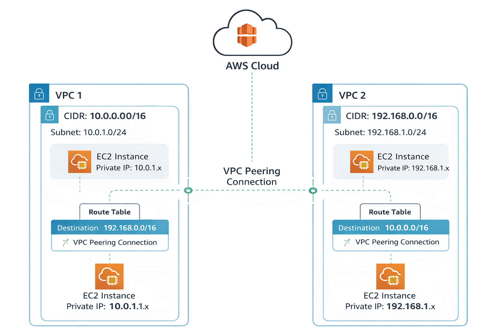
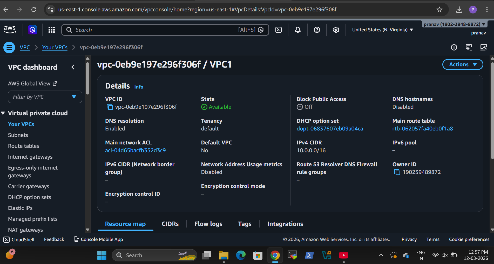
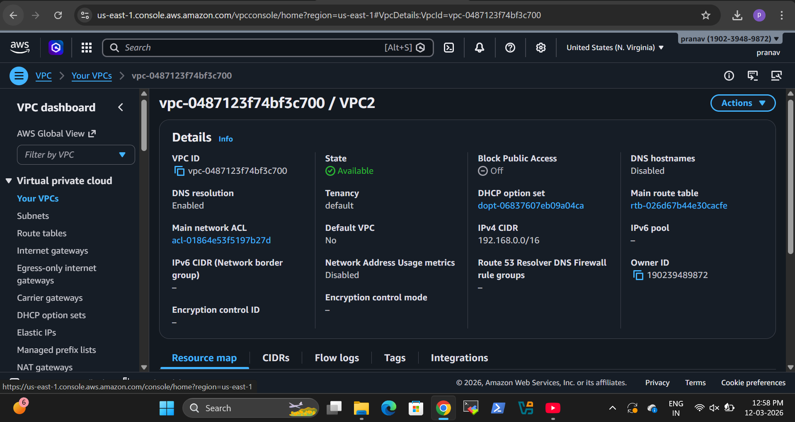

# AWS VPC Peering Project

## Project Overview
This project demonstrates how to connect two Virtual Private Clouds (VPCs) in AWS using VPC Peering.  
The goal of this project is to enable secure and private communication between EC2 instances located in different VPC networks without using the public internet.

This is a hands-on AWS networking lab designed to understand how organizations build secure cloud network architectures.

---

## Architecture Diagram

---

## AWS Services Used

- Amazon VPC
- Amazon EC2
- VPC Peering
- Route Tables
- Security Groups

---

## Network Architecture

Two VPCs were created with different CIDR ranges.

VPC 1  
CIDR Block: 10.0.0.0/16  
Subnet: 10.0.1.0/24  

VPC 2  
CIDR Block: 192.168.0.0/16  
Subnet: 192.168.1.0/24  

Each VPC contains an EC2 instance.  
A VPC Peering connection is established to allow private communication between these instances.

---

## Implementation Steps

### Step 1: Create VPCs
Two VPCs were created with unique CIDR ranges to avoid IP conflicts.

### Step 2: Create Subnets
Each VPC contains one subnet where EC2 instances are deployed.

### Step 3: Launch EC2 Instances
An EC2 instance was launched inside each VPC subnet.

### Step 4: Configure Security Groups
Security groups were configured to allow:
- SSH (Port 22)
- ICMP (Ping)

### Step 5: Create VPC Peering Connection
A VPC Peering connection was created between VPC1 and VPC2.

### Step 6: Update Route Tables
Routes were added in both VPC route tables to allow traffic through the peering connection.

VPC1 Route Table
Destination: 192.168.0.0/16  
Target: VPC Peering Connection

VPC2 Route Table
Destination: 10.0.0.0/16  
Target: VPC Peering Connection

### Step 7: Test Connectivity
Connectivity was verified by pinging the private IP address of the EC2 instance in the other VPC.

---

## Screenshots

### VPC 1

### VPC 2

### VPC Peering Connection

### Route Table Configuration

### Connectivity Test

---

## Key Learning Outcomes

- Understanding AWS Virtual Private Cloud (VPC)
- Configuring VPC Peering between networks
- Managing Route Tables in AWS
- Implementing secure private communication between cloud networks
- Hands-on experience with AWS networking services

---

## Future Improvements

- Implement VPC Peering across regions
- Add NAT Gateway architecture
- Deploy multi-tier architecture

---

## Author

Pranav Thakare  
Cloud & DevOps Learner

GitHub: https://github.com/pranavthakare74
